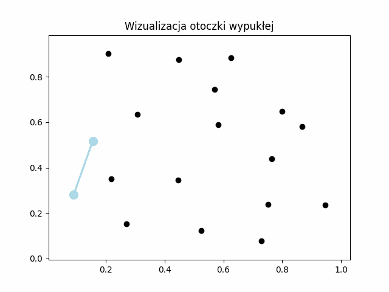
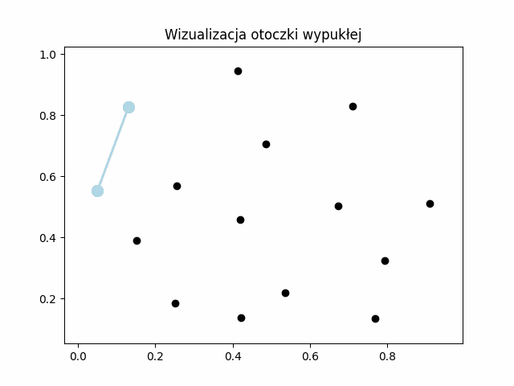
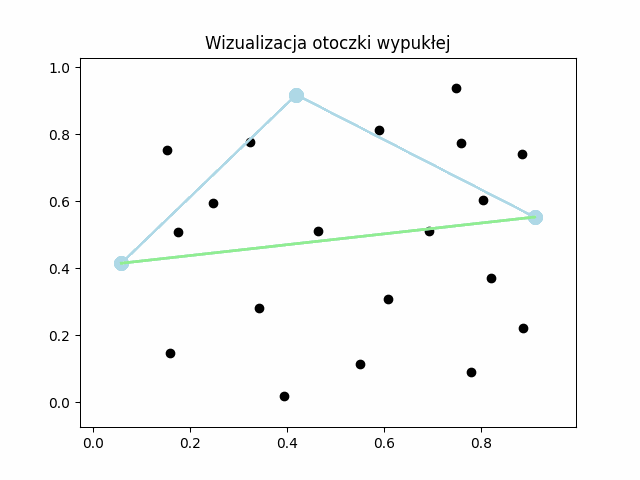
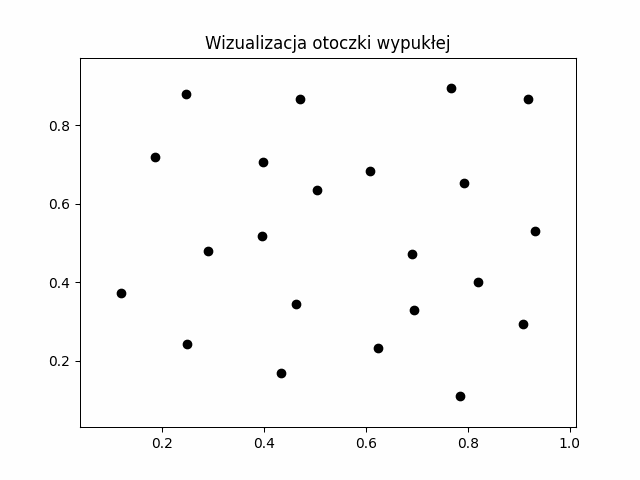
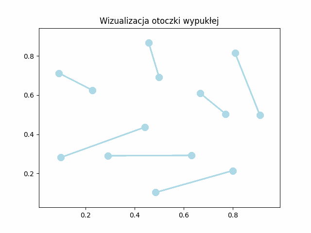
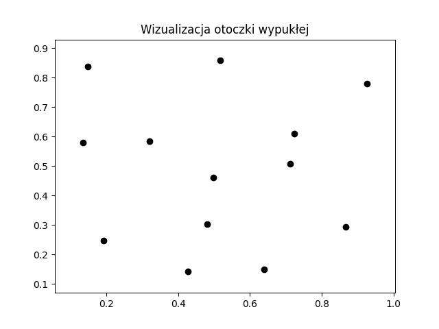
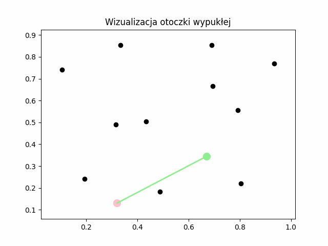

# Convex Hull Algorithms Project

## Overview
This project implements and analyzes several algorithms for computing the convex hull of a set of points in a two-dimensional space. The convex hull is the smallest convex polygon that contains all the points in the set. The implemented algorithms include:

- **Incremental Algorithm**
- **Upper and Lower Hull Algorithm**
- **Quickhull Algorithm**
- **Divide and Conquer Algorithm**
- **Chan's Algorithm**
- **Graham's Scan**
- **Gift Wrapping Algorithm**

The project aims to provide a comparison of these algorithms in terms of computational efficiency, practical execution time, and their strengths and weaknesses under different scenarios.

## Project Structure
The project is organized into several modules, each responsible for a specific part of the implementation and analysis:

- **`interface.ipynb`**: Contains key classes used in the project, including `Point`, `Segment`, `PolygonDrawer`, and `ConvexHullVisualizer`.
- **`install.ipynb`**: Handles the installation of necessary external libraries.
- **`tests.ipynb`**: Contains unit tests and performance tests for the implemented algorithms.
- **Algorithm-specific files**: Each algorithm is implemented in a separate file (e.g., `incremental.ipynb`, `quickhull.ipynb`, etc.), which includes the base implementation, visualization, and testing.

## Algorithms

### 1. Incremental Algorithm
- **File**: `incremental.ipynb`
- **Complexity**: O(n log n)
- **Description**: The algorithm builds the convex hull incrementally by adding points one by one and updating the hull at each step.

### 2. Upper and Lower Hull Algorithm
- **File**: `lower-upper-hull.ipynb`
- **Complexity**: O(n log n)
- **Description**: The algorithm constructs the convex hull by separately building the upper and lower hulls and then merging them.

### 3. Quickhull Algorithm
- **File**: `quickhull.ipynb`
- **Complexity**: O(n log n) average case, O(n²) worst case
- **Description**: A divide-and-conquer algorithm that recursively constructs the convex hull by finding the farthest points from a base line.

### 4. Divide and Conquer Algorithm
- **File**: `divide-and-conquer.ipynb`
- **Complexity**: O(n log n)
- **Description**: The algorithm recursively divides the set of points into smaller subsets, computes their convex hulls, and then merges them.

### 5. Chan's Algorithm
- **File**: `chan.ipynb`
- **Complexity**: O(n log h), where h is the number of points in the convex hull
- **Description**: Combines the advantages of Graham's scan and Jarvis by dividing the points into smaller subsets and using a wrapping approach to construct the hull.

### 6. Graham's Scan
- **File**: `graham.ipynb`
- **Complexity**: O(n log n)
- **Description**: The algorithm sorts the points by their polar angle and then iteratively constructs the convex hull using a stack.

### 7. Gift Wrapping Algorithm
- **File**: `jarvis.ipynb`
- **Complexity**: O(nh), where h is the number of points in the convex hull
- **Description**: The algorithm iteratively constructs the convex hull by finding the next point with the smallest polar angle relative to the current point.

## Usage
To run the algorithms, follow these steps:

1. Open the desired algorithm file (e.g., `incremental.ipynb`).
2. Run all cells in the notebook to initialize the environment and load the necessary libraries.
3. Use the `PolygonDrawer` class to graphically define a set of points.
4. Run the visualization section to see the algorithm in action and display the convex hull.
5. Run the test section to verify the correctness and performance of the algorithm.

## Test Cases
The project includes several test cases to evaluate the performance of the algorithms under different scenarios:

- **Random Set of Points**: Evaluates the algorithms on a randomly generated set of points.
- **Set with 4-8 Points on the Hull**: Tests the algorithms on a set where the convex hull consists of 4 to 8 points.
- **Set with 4 Points on the Hull**: Tests the algorithms on a set where the convex hull consists of exactly 4 points.
- **Points on a Circle**: Tests the algorithms on a set where all points lie on the circumference of a circle, forming the convex hull.

## Results
The performance of each algorithm was measured in terms of execution time for different sets of points. The results are summarized in the tables and graphs provided in the project documentation. Key findings include:

- **Quickhull** performed exceptionally well in scenarios with a small number of points on the hull.
- **Chan's Algorithm** was the most efficient when all points were on the hull, but its performance degraded in other scenarios due to suboptimal approximations.
- **Jarvis March** and the **Incremental Algorithm** showed limitations when the number of points on the hull was large.

## Conclusion
The project demonstrates that the choice of algorithm for computing the convex hull should be guided by the specific characteristics of the input data. While **Quickhull** and **Chan's Algorithm** showed superior performance in certain scenarios, other algorithms like **Graham's Scan** and the **Divide and Conquer Algorithm** provided more consistent results across different test cases.

## Authors
- **[Mateusz Wójcik](https://github.com/wmaqk1)**
- **[Błażej Naziemiec](https://github.com/Blizek)**
